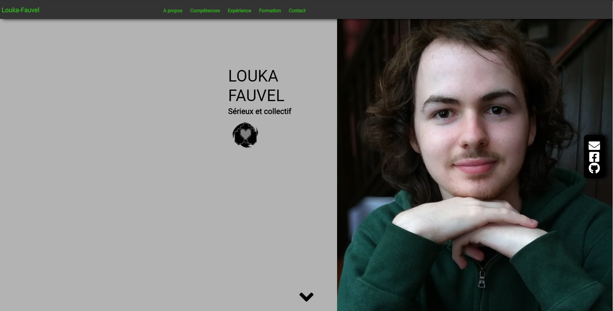
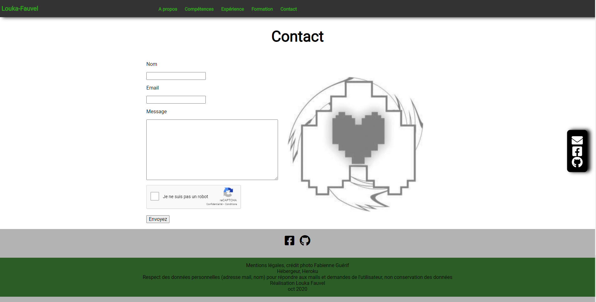

# Bienvenue sur mon site personnel !

**Objectif** : Créer un site personnel afin de promouvoir nos compétences dans le cadre professionnel.

**Lien des consignes** : https://slamwiki2.kobject.net/ateliers/missions/siteperso/

**Langages utilisés** : HTML, PHP, CSS, JS

**Screenshots** :

**A venir** : Au fur et à mesure de mes expériences, je serai amené à compléter mes informations personnnelles et à intégrer un maximum de données en PHP.

Réalisé par Louka Fauvel dans le cadre d'un projet d'étude en 1BTS SIO en octobre-novembre 2020 au SupAvenir Sainte-Ursule de Caen.
